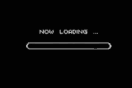
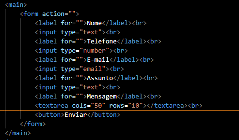
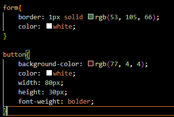

# Form_Contato

<h1 align="center"></h1>

Projeto criado como parte avaliativa da disciplina de Fundamentos de Desenvolvimento Web ministrada pelo professor Leonardo Rocha.

## Índice

* [Descrição](#descrição)
* [Tecnologias](#tecnologias)
* [Referências](#referências)
* [Autor(a)](#autora)

### Descrição

O projeto consiste na criação de um formulário de contato básico preenchivel, contendo: espaço para nome, telefone, e-mail, assunto e a mesagem de avaliação.

### Resultado do Projeto

### Confecção

O projeto foi confeccionado, utilizando HTML5. Foi criado um arquivo form.html. Nesse arquivo, constam configurações apresentadas a seguir:

    * main - Define o conteúdo principal dentro do body em seu documento ou aplicação.
    * Form - Define o formulário e os atributos que definem a maneira como esse formulário se comporta
    * textarea -  Representa um controle de edição para uma caixa de texto, útil quando você quer permitir ao usuário informar um texto extenso em formato livre, como um comentário ou formulário de retorno.
    * Label - Dá nome para a área de escrita, seja e-mail ou senha.
    * Input -  Permite que o usuário escreva na página.
    * Button -  Cria um botão clicável.

O projeto foi estilizado, utilizando CSS3. Foi criado um arquivo form.css. Nesse arquivo, constam configurações de estilo apresentadas a seguir:

    * Border - Define a borda de um elemento
    * Font-weight - A propriedade font-weight define quão grossos ou finos os caracteres do texto devem ser exibidos.
    * background-color: altera cor de fundo.
    * width: A propriedade define a largura de um elemento;
    * heigth: A propriedade define a altura de um elemento.

## Tecnologias

* HTML5
* CSS3
* README
* Git
* Github

## Referências

[Alura](https://www.alura.com.br/artigos/escrever-bom-readme) - Como escrever um README incrível no seu Github 
[w3schools](https://www.w3schools.com/cssref/pr_border.php) - Explica o uso do border 
[w3schools - 2](https://www.w3schools.com/cssref/pr_font_weight.php) - Explica o uso do font-weight 
[w3schools - 3](https://www.w3schools.com/cssref/pr_dim_width.php) - Explica o uso do width 
[w3schools - 4](https://www.w3schools.com/cssref/pr_dim_height.php) - Explica o uso do heigth 
[mozilla](https://developer.mozilla.org/pt-BR/docs/Web/HTML/Element/main) - Explica o uso do main 
[w3schools - 5](https://www.w3schools.com/html/html_forms.asp) - Explica o uso do form 
[w3schools - 6](https://www.w3schools.com/tags/tag_textarea.asp) - Explica o uso do textarea 
[w3schools - 7](https://www.w3schools.com/tags/tag_label.asp) - Explica o uso do label 
[w3schools - 8](https://www.w3schools.com/tags/tag_input.asp) - Explica o uso do input 
[w3schools - 9](https://www.w3schools.com/tags/tag_button.asp) - Explica o uso do button 

## Autor(a)

O projeto foi desenvolvido por:
 Vivian Oliveira Almeida